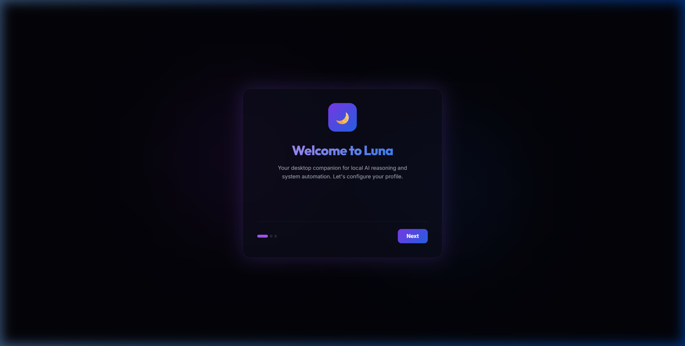
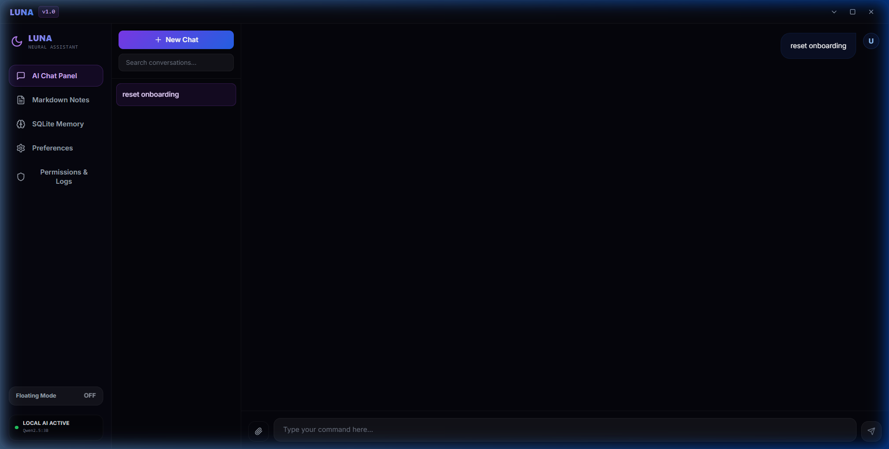
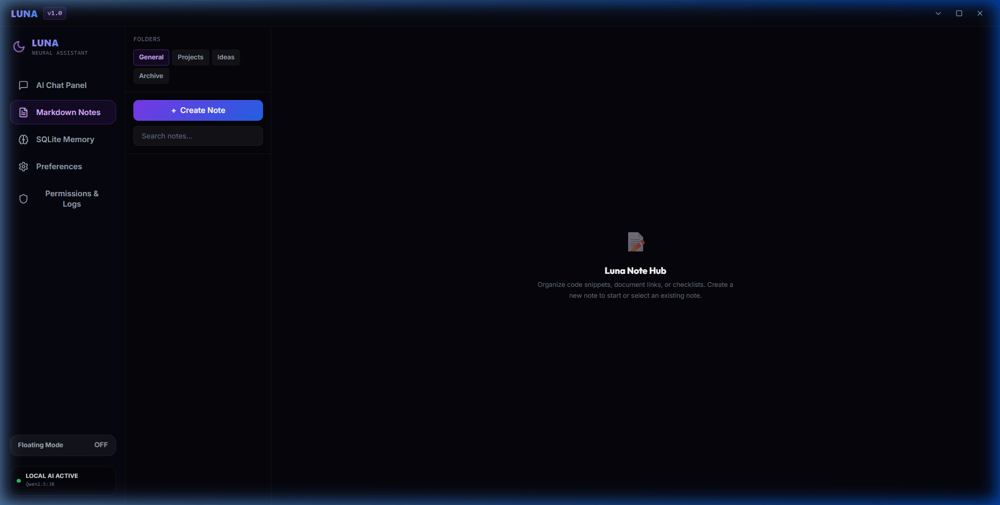
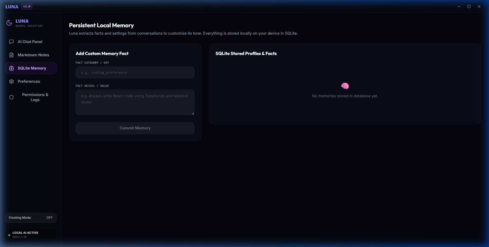
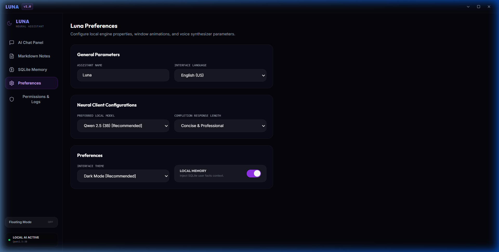
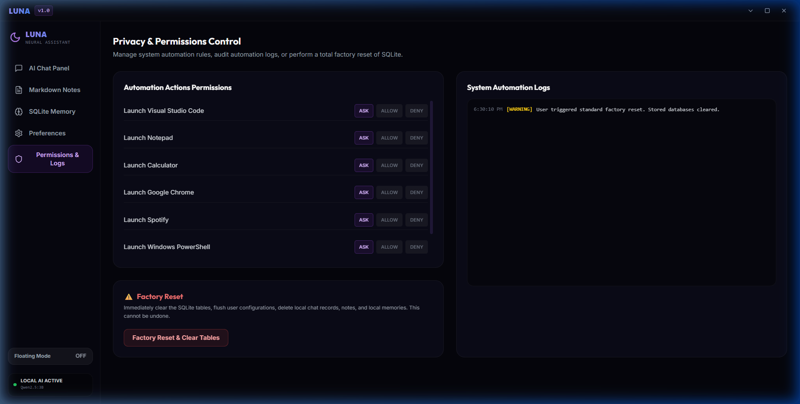

# Luna AI Assistant 🌙

Luna is a premium desktop AI assistant MVP built to demonstrate privacy-first local AI, desktop automation, and personalized workflows. It is optimized to run smoothly on standard consumer hardware (e.g., CPU-only Windows systems with 8GB RAM), keeping memory usage strictly under 1.5GB.

---

## 🎨 Application Tour

| Onboarding Welcome | AI Chat Interface |
|:---:|:---:|
|  |  |

| Markdown Notebook | SQLite Memory |
|:---:|:---:|
|  |  |

| Preferences Settings | Privacy & Automation Audits |
|:---:|:---:|
|  |  |

---

### 🏛️ Core Design Principles
*   **Local-First Architecture**: All database storage, document parsing, settings, and automation run entirely on your local machine.
*   **Privacy-First Design**: Zero tracking, absolute user data ownership, transparent system permission audits, and offline-first database.
*   **Consumer Hardware Optimized**: Fully optimized for low-end machines. Bypasses GPU requirements, running model inference directly on your CPU.
*   **Offline Capable & Zero Crash Fallback**: Entirely operational offline. If Ollama is not active or available, Luna automatically switches to **Demo Mode** with intelligent, context-aware mock streaming responses to ensure the application never crashes.

---

## 🚀 Key Features

1. **Local Streaming AI Chat**:
   - Streams completions from local models (such as `Qwen2.5:3B` or `Phi-3 Mini`) using server-sent event streams.
   - **Intelligent Demo Mode**: If Ollama is not installed or running, Luna automatically transitions into an offline demo mode with mock streaming to ensure the app never crashes.
   - Dynamic markdown formatting, tables, lists, and syntax-highlighted code blocks with clip copy options.

2. **Persistent Local Memory**:
   - Persistent key-value user facts database in SQLite (e.g., name, preference parameters, custom coding guidelines).
   - Keeps track of contextual details to dynamically mold the assistant's tone.

3. **Native Desktop Automation**:
   - Natural language intent recognition triggers native app launching (VS Code, Chrome, Spotify, Notepad, Calculator, Terminal, File Explorer).
   - **Security Gated**: Displays a glassmorphic permission modal before executing any Windows command. Allows users to save rules (Always Allow, Always Deny, Ask).
   - **File Organizer**: Automatically scans, categorizes, and organizes the user's Downloads directory based on file extensions.

4. **Document Parser**:
   - Drag-and-drop file uploader (supports PDF, DOCX, TXT, and Images).
   - Extracts page contents and outputs summaries immediately.

5. **Integrated Markdown Notes**:
   - Full note creation, folder organization, and markdown editing workspace.
   - Automatic debounced background autosaving directly to the SQLite database.

6. **Privacy & Audit Logs Dashboard**:
   - Shows active database status, let's you toggle permissions dynamically, and streams audit logs from system processes.
   - A single-click **Factory Reset** that safely wipes all SQLite tables and user preferences.

---

## 🛠️ Technology Stack

- **Frontend (UI/UX)**:
  - **Electron**: App wrapper, frameless title bar, tray integration, global hotkeys.
  - **React + Vite + TypeScript**: Strict type-safe UI compilation and fast dev cycles.
  - **TailwindCSS**: Elegant dark-theme visual parameters (Outfit & Inter fonts).
  - **Framer Motion**: Subtle, fluid window transitions and forms sliders.
  - **Zustand**: Lightweight stores management to avoid React rerender bottlenecks.

- **Backend (Intelligence Engine)**:
  - **FastAPI + Python**: Lightweight local server for database migrations, file parsing, and LLM streaming.
  - **SQLite + SQLAlchemy**: High-performance local SQL database.
  - **PyInstaller**: Compiles Python backend into a single-file Windows executable (`luna-backend.exe`).

---

## 📂 Directory Layout

```text
luna-assistant/
├── backend/                    # Python FastAPI Backend
│   ├── app/
│   │   ├── api/                # API routes (chat, notes, settings, logs)
│   │   ├── automation/         # Intent parser, Windows commands, task runner
│   │   ├── core/               # Configuration, security, logging
│   │   ├── database/           # SQLite setup, models, and migrations
│   │   ├── schemas/            # Pydantic schemas (request/response)
│   │   └── services/           # Business logic: Ollama, file uploads
│   ├── requirements.txt        # Backend dependencies
│   └── run.py                  # Standalone backend script runner
├── frontend/                   # Electron + React Frontend
│   ├── src/
│   │   ├── main/               # Electron Main Process (window, lifecycles)
│   │   ├── preload/            # Electron Preload script
│   │   └── renderer/           # React App
│   │       ├── src/
│   │       │   ├── components/ # Reusable UI components (Titlebar, Modals, Toasts)
│   │       │   ├── stores/     # Zustand stores (chat, settings, memory, notes)
│   │       │   └── views/      # Onboarding, Dashboard, Chat, Notes, Privacy
│   ├── package.json            # Electron & React dependencies
│   └── electron-builder.yml    # Installer configuration
└── README.md
```

---

## ⚙️ Development Setup

### 1. Prerequisites
- **Node.js** (v18 or higher)
- **Python** (v3.10 or higher)
- **Ollama** (Optional - for local LLM inference)
  - Install and run Ollama from [ollama.com](https://ollama.com)
  - Download Qwen: `ollama run qwen2.5:3b`

### 2. Backend Installation
```bash
# Navigate to backend directory
cd backend

# Create a virtual environment
python -m venv .venv

# Activate virtual environment
.venv\Scripts\activate

# Install requirements
pip install -r requirements.txt
```

### 3. Frontend Installation & Startup
```bash
# Navigate to frontend directory
cd ../frontend

# Install node dependencies
npm install

# Run the app in development mode
# (This concurrently starts the Vite dev server and opens the Electron window)
npm run dev
```

---

## 📦 Production Packaging

To compile a standalone offline package (useful for distribution without requiring Node or Python environments on the client machine):

### 1. Compile the Python Backend
Run the PyInstaller script in the backend directory:
```bash
cd backend
.venv\Scripts\pip install pyinstaller
.venv\Scripts\pyinstaller --onefile --name luna-backend --clean run.py
```
This compiles the backend service into a single `.exe` file placed in `backend/dist/luna-backend.exe`.

### 2. Bundle the Electron Installer
`electron-builder` is configured to automatically copy the compiled backend binary into the application resources:
```bash
cd ../frontend
npm run package
```
This command compiles the React assets, builds the Electron Main TypeScript, and packages the entire app into a single distributable zip package:
- **Output ZIP**: `frontend/dist-package/Luna-1.0.0-win.zip`
- **Output Executable**: `frontend/dist-package/win-unpacked/Luna.exe`

---

## ⌨️ Keyboard Shortcuts & Window Toggles

- **Global Summon**: Press `Alt + Space` from anywhere on Windows to toggle the visibility of the assistant window.
- **Floating Panel Mode**: Toggle the **Floating Mode** button in the sidebar to transform the window into a compact, locked overlays sidebar widget (`380x600`), and click it again to return to the rich, widescreen dashboard (`1200x800`).
